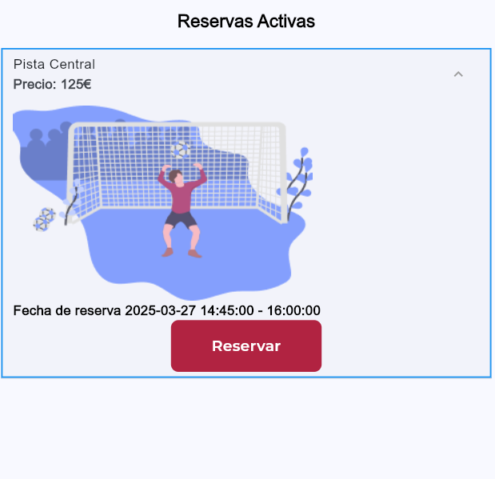

# Proyecto Raul

## Description

This project is designed to [insert brief description of the project's purpose and functionality here].

## Manual

### Installation

1. Clone the repository: `git clone [repository-url]`
2. Navigate to the project directory: `cd proyecto_raul`
3. Install dependencies: `flutter pub get`
   - Dependencies:
     - cached_network_image: ^3.2.1
     - country_picker: ^2.0.27
     - cupertino_icons: ^1.0.8
     - device_info_plus: ^11.2.2
     - encrypt: ^5.0.3
     - equatable: ^2.0.7
     - file_picker: ^8.1.6
     - firebase_auth: ^5.3.4
     - firebase_core: ^3.8.1
     - firebase_messaging: ^15.2.1
     - firebase_remote_config: ^5.3.1
     - flutter: (sdk: flutter)
     - flutter_bloc: ^8.1.6
     - flutter_dotenv: ^5.2.1
     - flutter_launcher_icons: ^0.14.2
     - flutter_local_notifications: ^18.0.1
     - flutter_localizations: (sdk: flutter)
     - flutter_secure_storage: ^9.2.4
     - flutter_secure_storage_web: ^1.0.0
     - flutter_spinkit: ^5.1.0
     - get: 4.6.5
     - get_it: ^8.0.3
     - go_router: ^14.6.2
     - google_fonts: ^6.2.1
     - http: ^1.2.2
     - http_parser: ^4.0.2
     - image_picker: ^0.8.5+3 q
     - intl: any
     - pull_to_refresh: ^2.0.0
     - shared_preferences: ^2.3.2
     - syncfusion_flutter_datepicker: ^20.1.59

### Usage

### Tutorial

A continuación, se muestra un tutorial paso a paso utilizando capturas de pantalla para guiarte a través del uso de la aplicación.

1. **Pantalla de Inicio de Sesión**
   

- Ingresa tus credenciales para acceder a la aplicación.

2. **Pantalla de Registro**
   

- Completa el formulario de registro para crear una nueva cuenta.

3. **Pantalla de Inicio**
   

- Una vez que hayas iniciado sesión, serás dirigido a la pantalla de inicio.

4. **Pantalla de Activación**
   

- Activa tu cuenta siguiendo las instrucciones en esta pantalla.

5. **Pantalla de Historial**
   

- Consulta el historial de tus actividades en esta sección.

6. **Menú de Usuario**
   

- Accede al menú de usuario para gestionar tu perfil y configuraciones.

7. **Pantalla de Actualización**
   

- Actualiza tu información personal en esta pantalla.

Para ejecutar el proyecto, utiliza el comando `flutter run`.

- Para ejecutar el pryecto `flutter run`
